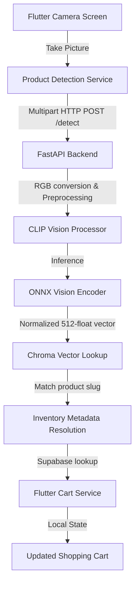

<p align="center">
  
</p>


Qless is a modern mobile and backend prototype designed to enable seamless, AI-assisted self-checkout in retail environments. By leveraging computer vision and vector similarity search, Qless allows shoppers to scan products using their mobile device's camera, matches the visual identity against a vector catalog, and resolves it locally to cart-ready retail metadata in milliseconds.

> [!NOTE]
> **Current Project Status (In Development):** The hot path is fully implemented using a FastAPI backend (`hf_server/app.py`), a mobile Flutter app, Chroma, Supabase, and a client-side local cache (`inventory.json`). High-velocity components like client-side WebP compression and synthetic catalog data augmentation are planned milestones in the development lifecycle.

---

## 1. Architecture Overview

### Runtime Data Flow & Image Processing



### Flow Breakdown

1. **Mobile Capture (`lib/screens/dashboard_screen.dart`):** Utilizes `CameraController` at low resolution to reduce upload payloads.
2. **Detection Client (`lib/services/product_detection_service.dart`):** Sends the image to the FastAPI backend via a multipart POST request with Chroma authentication headers.
3. **fastAPI Service (`hf_server/app.py`):** Preprocesses the image, runs inference on a local ONNX model (`Xenova/clip-vit-base-patch32`), and queries Chroma Cloud.
4. **Local Metadata Resolution (`lib/services/inventory_service.dart`):** Map the matched product slug back to local metadata (`inventory.json`) in 0ms to bypass external database lookup latency.
5. **State Sync & Persistence (`lib/services/cart_service.dart`):** Persists the mutated cart local state using `SharedPreferences` and optionally synchronizes with Supabase.

---

## 2. API Endpoints Reference

The FastAPI backend exposes the following endpoints for the mobile client:

| Endpoint | Method | Description | Response Shape |
| :--- | :--- | :--- | :--- |
| `/` | `GET` | Server status and active CLIP model identification | `{ "status": "running", "model": "...", "device": "cpu" }` |
| `/health` | `GET`, `HEAD` | Liveness probe for deployment/tunnel monitoring | `{ "status": "ok" }` |
| `/embed` | `POST` | Generate and return raw CLIP embeddings for an image | `{ "status": "success", "embedding": [...] }` |
| `/detect` | `POST` | Run full detection path (embed + vector match + local resolve) | `{ "status": "success", "match_found": true, "item": {...} }` |
| `/gallery` | `GET` | HTML dashboard showing recently captured scan images | HTML Page |
| `/captured_images/{file}`| `GET` | Retrieve a specific raw captured image asset | Image binary |

---

## 3. Retail Data Model

To achieve ultra-low latency, the client app pre-loads product catalog information at startup.

| Field | Source | Example Value | Usage |
| :--- | :--- | :--- | :--- |
| `sku` | Local Catalog / Supabase | `QLS-0004` | Unique product identifier (details display) |
| `slug` | Local Catalog / Chroma | `american-style-cream-onion-lays` | Join key between vector catalog & local metadata |
| `name` | Local Catalog | `Lay's American Style Cream & Onion` | Product display name in the cart |
| `price_rupees`| Local Catalog | `20.0` | Item price in INR for billing calculations |
| `thumbnail_url`| Supabase Storage | `https://.../product-images/...` | Lazy-loaded cached thumbnail image |

---

## 4. Latency & Performance Design

To ensure an instantaneous scan-and-go experience, the architecture implements several performance-critical designs:

* **Static ONNX Model Loading:** The `CLIPProcessor` and `ort.InferenceSession` are initialized only once at server startup, preventing per-request model loading overhead.
* **CPU Thread Capping:** Configured to `intra_op_num_threads = 2` and `inter_op_num_threads = 2` to maximize performance on constrained serverless CPU runtimes.
* **Async Connection Pooling:** Outbound network calls to Chroma Cloud and Supabase are executed using a persistent, shared `httpx.AsyncClient`.
* **Zero-Latency Metadata Resolution:** By querying `inventory.json` locally on the device, the app eliminates database search roundtrips for fetching basic product metadata (SKU, price, name).
* **Background Logging:** Captures are saved to the backend disk asynchronously via FastAPI `BackgroundTasks`, keeping it off the client response critical path.

---

## 5. Prerequisites & Environment Setup

### Required Toolchain

* **Flutter SDK** (`^3.12.2`)
* **Python** (3.9+)
* **ngrok** (for tunneling external mobile traffic to your local server)
* **Chroma API Key** and **Supabase Keys** (see below)

### 1. Configure the Mobile Client (.env)
Create a `.env` file at the root directory of the Flutter project:

```env
CHROMA_API_KEY=your_chroma_api_key_here
HF_SPACE_URL=https://<your-hf-space>.hf.space/embed
SUPABASE_URL=https://<your-project-ref>.supabase.co
SUPABASE_ANON_KEY=your_supabase_anon_key_here
```

### 2. Setup Python Virtual Environment

**Windows (PowerShell):**
```powershell
python -m venv .venv
.\.venv\Scripts\Activate.ps1
python -m pip install --upgrade pip
python -m pip install -r hf_server\requirements.txt
```

**macOS / Linux:**
```bash
python3 -m venv .venv
source .venv/bin/activate
python -m pip install --upgrade pip
python -m pip install -r hf_server/requirements.txt
```

---

## 6. Seeding & Ingestion

### Local Catalog Initialization
The app loads `inventory.json` containing 56 base supermarket products at startup:
```dart
await Future.wait([
  InventoryService().initLocalCatalog(),
  CartService().load(),
]);
```

### Supabase Seeding
To populate the Supabase database, run the generation script to create a SQL seed file and run it in your Supabase SQL editor:
```bash
# Generates artifacts/supabase_seed.sql
python scripts/generate_seed.py
```

### Uploading Thumbnails
Upload product assets from `assets/Images` to the Supabase storage bucket (`product-images`) and update metadata URLs:
```bash
# Requires SUPABASE_SERVICE_ROLE_KEY to be set in your environment or .env
python scripts/upload_thumbnails.py
```

---

## 7. Deployment & Local Verification

### 1. Launch FastAPI Backend
Start the local ASGI server from the repository root:
```bash
uvicorn hf_server.app:app --host 0.0.0.0 --port 8000 --workers 1
```

Validate liveness:
```bash
curl http://127.0.0.1:8000/health
```

### 2. Expose the Server via ngrok
To access the local backend from a physical mobile device:
```bash
ngrok http 8000
```
Copy your ngrok forwarding URL and update `HF_SPACE_URL` in your `.env` file.

### 3. Test Ingestion/Detection via Curl
```bash
curl -X POST "https://<your-ngrok-host>.ngrok-free.app/detect" \
  -H "ngrok-skip-browser-warning: true" \
  -H "X-Chroma-Token: <your-chroma-key>" \
  -F "file=@assets/Images/Quaker Oats.webp"
```

### 4. Run the Mobile App
```bash
# Run on a connected device/emulator
flutter run
```
